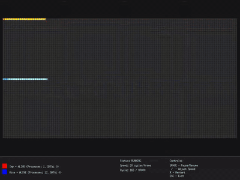
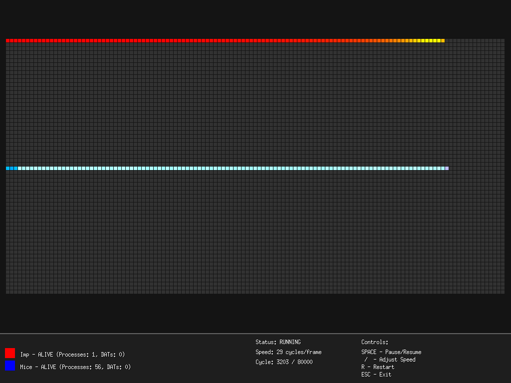
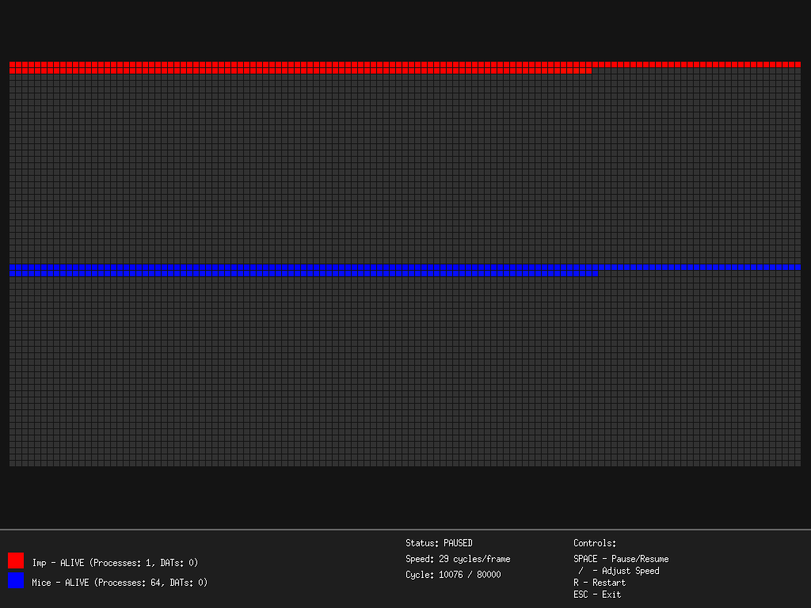
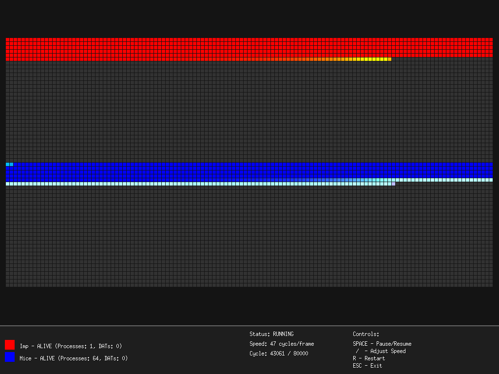

# Corewar Go

A programming game and visual Core War simulator written in Go with Ebitengine. Two small Redcode programs, called **warriors**, compete in a shared circular memory: they copy instructions, place `DAT` bombs and create processes while trying to eliminate their opponent.

Watch the memory change in the graphical viewer, run a battle with a console report, or compare warriors in a round-robin tournament. The project includes a simplified Redcode assembler, its own virtual machine and 17 example `.red` files.

## Watch a battle

[](https://github.com/olivierh59500/corewar-go/raw/refs/heads/main/docs/media/preview.mp4)

**[Watch the 24-second presentation video (MP4, silent)](https://github.com/olivierh59500/corewar-go/raw/refs/heads/main/docs/media/preview.mp4)** · [Download the MP4](docs/media/preview.mp4) · [View the silent GIF](docs/media/preview.gif)

The capture follows the supplied **Imp** and **Mice** warriors, pauses the simulation, resumes it and increases the speed. The nine-second GIF combines three excerpts. Corewar Go has no music or sound effects; both previews are silent.

| Early execution | Paused battle | Later memory state |
| --- | --- | --- |
| [](docs/media/screenshot-1.png) | [](docs/media/screenshot-2.png) | [](docs/media/screenshot-3.png) |

Click a screenshot for its native 1024 × 768 image. These captures use the project's renderer and VM, with the same warriors as the command below.

## Run and build

Requires **Go 1.24.4 or later**, a desktop display for the visual mode, and the platform dependencies required by **Ebitengine 2.8.8**, the version pinned in [go.mod](go.mod). Linux builds need its graphics development libraries as well as a working graphical session. See the [pinned Ebitengine source and platform guidance](https://github.com/hajimehoshi/ebiten/tree/v2.8.8).

```sh
git clone https://github.com/olivierh59500/corewar-go.git
cd corewar-go
go mod download
go run . -w1 warriors/imp.red -w2 warriors/mice.red
```

This opens the visual viewer with the pair shown in the video. `go run .` uses the built-in Imp and Dwarf definitions. Select a different pair by supplying **both** `-w1` and `-w2`.

Build a desktop executable:

```sh
go build -o corewar-go .
./corewar-go -w1 warriors/imp.red -w2 warriors/classicdwarf.red
```

Run these commands from the repository directory so the example files are available. Warrior files are read from disk; paths are relative to the current working directory. The executable also contains the built-in warrior definitions.

## Visual mode and controls

| Key | Action |
| --- | --- |
| Space | Pause or resume |
| Up / Down | Increase or decrease speed; hold to adjust continuously |
| R | Restart the current pair |
| Esc | Exit |

The viewer starts automatically. Speed ranges from **1 to 100 VM cycles per frame**, initially 10; one VM cycle executes one process instruction. Restart resets the battle and speed. When a battle finishes, its result remains on screen and a detailed report is printed to the console.

The grid represents **8,000 memory cells**. Gray cells are unclaimed; red and blue identify the two warriors. Execution brightens a cell, writes add a yellow tint, and reads add a green tint. Owned `DAT` instructions appear darker. The bottom panel shows each warrior's alive/dead state, active processes and owned `DAT` count, alongside the simulation status, speed and cycle counter.

Warriors are selected through the command line. The viewer provides keyboard control of the running simulation.

## Console battle and tournament modes

Run one battle to completion and print its report:

```sh
go run . -mode battle -w1 warriors/imp.red -w2 warriors/mice.red
```

The report includes the winner or draw, elapsed time, total cycles, maximum active processes, instruction counts, starting positions and each warrior's share of executed instructions.

Run a tournament:

```sh
go run . -mode tournament -rounds 10
```

The current loader reads `warriors/*.red` in filename order and takes the **first four files that assemble successfully**. Invalid files are skipped. If fewer than two load, the tournament uses four built-in warriors. Each selected pair fights the requested number of rounds, swapping starting positions on alternate rounds. The final table ranks warriors by wins and reports the total battles and draws. With four warriors and ten rounds per pair, this gives 60 battles.

`-rounds` applies to tournament mode; `-w1` and `-w2` select the pair in visual or battle mode. Console modes still import Ebitengine and need its platform dependencies.

## Simulation rules

- Memory wraps around an **8,000-cell** core, initially filled with `DAT #0, #0`.
- Two warriors start at addresses **0 and 4,000**. Starting positions are fixed; tournaments alternate which warrior receives each position.
- Processes share a round-robin execution queue. `SPL` can create up to **64 active processes per warrior**.
- Executing `DAT` kills the current process. This VM also kills a process when it reaches a cell owned by the opposing warrior.
- A warrior survives while it has at least one active process. One remaining warrior wins; no surviving warriors or reaching **80,000 cycles** produces a draw.

## Write a warrior

Use a `.red` text file with instructions, integer operands, labels ending in `:`, and `;` comments. `;name` and `;author` provide the name and author used in reports. For example:

```redcode
;redcode
;name My Imp
;author Your Name
;strategy Copy one instruction through memory

imp:    MOV 0, 1

END imp
```

Save it as `warriors/my-imp.red`, then run:

```sh
go run . -w1 warriors/my-imp.red -w2 warriors/mice.red
```

Addresses and labels are relative to the instruction using them. Supported addressing prefixes are immediate `#`, direct `$` (also the default), indirect `@`, pre-decrement `<` and post-increment `>`. Indirect addressing uses the pointer instruction's B field.

| Instruction | Behavior in this VM |
| --- | --- |
| `DAT` | Terminate the current process |
| `MOV` | Copy an instruction; an immediate A operand writes a `DAT` bomb |
| `ADD` / `SUB` | Add or subtract fields; an immediate A operand changes the destination's B field |
| `JMP` | Jump to the A target |
| `JMZ` / `JMN` | Test the A value or its B field, then jump to the B target when zero / nonzero |
| `DJN` | Decrement the A location's B field, then jump to the B target when it reaches zero |
| `CMP` / `SEQ` | Compare B fields or immediate values; skip the next instruction when equal |
| `SPL` | Create a process at the A target |

This is an experimental Redcode subset with custom execution rules. ICWS '94 warriors may need adaptation: instruction modifiers, arithmetic expressions and assembly macros are unsupported; `END` does not choose an entry point, and the initial process starts at the first instruction. `NOP` is recognized but discarded during assembly. Pointer updates for `<` and `>` are stored only when resolving write operands. The conditional instructions and memory-ownership rule above also affect compatibility. Start with the supplied examples when writing for this VM.

Useful examples include [Imp](warriors/imp.red), [Mice](warriors/mice.red), [ClassicDwarf](warriors/classicdwarf.red), [Scanner](warriors/scanner.red) and [Vampire](warriors/vampire.red). Each file retains its author and strategy comments.

## Development

```sh
go build .
go vet ./...
go test ./...
```

The repository currently has no `_test.go` files, so `go test` provides a package compilation check. `debugbattle.go` and `testbattle.go` contain diagnostic helper functions; they are part of the application rather than automated tests.

- [main.go](main.go): modes, viewer state and keyboard input.
- [core.go](core.go) and [vm.go](vm.go): circular memory, instruction execution and process scheduling.
- [assembler.go](assembler.go) and [loader.go](loader.go): Redcode parsing, metadata and file loading.
- [battle.go](battle.go): results, statistics and round-robin tournaments.
- [graphics.go](graphics.go): memory grid, activity colors and status panel.
- [warrior.go](warrior.go) and [warriors/](warriors): built-in definitions and editable examples.

Contributions can add warriors, improve the viewer, expand assembler compatibility or validate VM behavior.

## License and credits

Copyright © 2025 Olivier Houte. Distributed under the [MIT License](LICENSE).

Inspired by Core War and the ICWS Redcode tradition. The bundled warrior metadata credits A.K. Dewdney, Chip Wendell and the Core War community; those credits remain in the example files.
